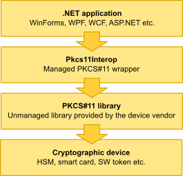

Pkcs11Interop
=============
**Managed .NET wrapper for unmanaged PKCS#11 libraries**

> **PLEASE NOTE: If your application only needs to perform signing or encryption with RSA or EC keys, consider using the [Pkcs11Interop.X509Store](https://github.com/Pkcs11Interop/Pkcs11Interop.X509Store) library. It offers a simpler and more developer-friendly alternative to the full Pkcs11Interop library. Additionally, it includes providers that easily integrate with other built-in .NET classes such as `SignedCms` and[`SignedXml`.**

## Overview

PKCS#11 is a cryptographic standard maintained by the OASIS PKCS 11 Technical Committee (originally published by RSA Laboratories). It defines an ANSI C API to access smart cards and other types of cryptographic hardware.

Pkcs11Interop is a managed library written in C# that brings the full power of the PKCS#11 API to the .NET environment. It loads the unmanaged PKCS#11 library provided by the cryptographic device vendor and makes its functions accessible to .NET applications.

The following figure illustrates the typical usage of the Pkcs11Interop library in a .NET application:

The Pkcs11Interop library:

- Implements a .NET wrapper for unmanaged PKCS#11 libraries.
- Is compliant with the [PKCS#11 v2.40](https://github.com/Pkcs11Interop/PKCS11-SPECS/tree/master/v2.40) specification and the PKCS#11 URI scheme defined in [RFC 7512](https://github.com/Pkcs11Interop/PKCS11-SPECS/tree/master/RELATED/RFC7512).
- Is compatible with .NET Framework 2.0 and higher, .NET Core, Mono, and Xamarin.
- Is supported on Windows, Linux, macOS, Android, and iOS.
- Is supported on both 32-bit and 64-bit platforms.
- Is open source and completely free for commercial use.
- Is used in production by several information security and financial organizations.
- Uses 100% managed and fully documented code.
- Contains code samples covering all methods of the PKCS#11 API.

Pkcs11Interop has been confirmed to work with the following devices:

- Atos CardOS (formerly Siemens CardOS) smartcard
- Thales nShield Solo (formerly nCipher nShield) HSM
- SoftHSM (virtual HSM from the OpenDNSSEC project)
- Feitian ePass 2003 token
- SafeNet ProtectServer HSM
- SafeNet Luna SA HSM
- Utimaco CryptoServer HSM
- Belgian and Slovak eID cards
- SmartCard-HSM
- YubiKey with the PIV application

## Documentation

The Pkcs11Interop API is fully documented with inline XML documentation, which is displayed by most modern IDEs during application development.

Before you start using Pkcs11Interop, it is highly recommended that you familiarize yourself with at least the following chapters of the [PKCS#11 v2.20](https://github.com/Pkcs11Interop/PKCS11-SPECS/tree/master/v2.20) specification (or equivalent chapters of any previous or subsequent specification versions):
- *Chapter 2 - Scope*
- *Chapter 6 - General Overview*
- *Chapter 10 - Objects*

The following topics are covered by standalone documents:
- [Quick Introduction to PKCS#11 Terminology](doc/01_TERMINOLOGY.md)
- [Quick Introduction to PKCS#11 Objects](doc/02_OBJECTS.md)
- [Quick Introduction to PKCS#11 Sessions](doc/03_SESSIONS.md)
- [Pkcs11Interop Library Architecture](doc/04_ARCHITECTURE.md)
- [Pkcs11Interop Interfaces](doc/05_INTERFACES.md)
- [Getting Started with Pkcs11Interop](doc/06_GETTING_STARTED.md)
- [Pkcs11Interop Code Samples](doc/07_CODE_SAMPLES.md)
- [Troubleshooting Pkcs11Interop with PKCS11-LOGGER](doc/08_TROUBLESHOOTING.md)
- [Frequently Asked Questions](doc/09_FAQ.md)

## Download

Official [NuGet packages](https://www.nuget.org/packages/Pkcs11Interop/) are published in the nuget.org repository.  
Archives containing the source code and binaries can be downloaded from [our releases page](https://github.com/Pkcs11Interop/Pkcs11Interop/releases/).  
All official items are signed with the [GnuPG key or code-signing certificate of Jaroslav Imrich](https://www.jimrich.sk/crypto/) and announced via the [public mailing list](https://groups.google.com/d/forum/pkcs11interop).

## License

Pkcs11Interop is available under the terms of the [Apache License, Version 2.0](https://www.apache.org/licenses/LICENSE-2.0).  
A [human-friendly license summary](https://www.tldrlegal.com/license/apache-license-2-0-apache-2-0) is available on tldrlegal.com, but the [full license text](LICENSE.md) always prevails.

## Support

If you need help, please choose one of the options that best suits your needs:

- Public [issue tracker](https://github.com/Pkcs11Interop/Pkcs11Interop/issues) available on GitHub.
- Questions with the [pkcs#11 tag](https://stackoverflow.com/questions/tagged/pkcs%2311) and [pkcs11interop tag](https://stackoverflow.com/questions/tagged/pkcs11interop) posted on StackOverflow.
- Commercial support and consulting from the original developer available upon request at [info@pkcs11interop.net](mailto:info@pkcs11interop.net).

## Related Projects

* [Pkcs11Admin](https://www.pkcs11admin.net/)  
  GUI tool for administration of PKCS#11 enabled devices based on Pkcs11Interop library.
* [PKCS11-LOGGER](https://github.com/Pkcs11Interop/pkcs11-logger)  
  PKCS#11 logging proxy module useful for debugging of PKCS#11 enabled applications.
* [SoftHSM2-for-Windows](https://github.com/disig/SoftHSM2-for-Windows)  
  Pure software implementation of a cryptographic store accessible through a PKCS#11 interface.
* [Bouncy HSM](https://github.com/harrison314/BouncyHsm)  
  HSM and smartcard simulator with HTML UI, REST API and PKCS#11 interface.

## About

Pkcs11Interop has been written by [Jaroslav Imrich](https://www.jimrich.sk).  
Please visit project website - [pkcs11interop.net](https://www.pkcs11interop.net) - for more information.
