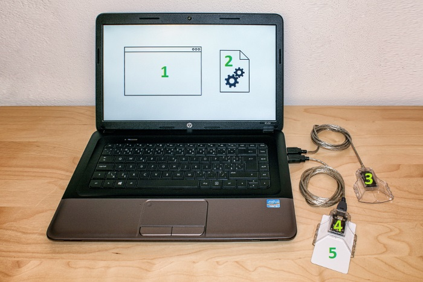

# Basic PKCS#11 Related Terms

**PKCS#11** is a cryptography standard that specifies an ANSI C API for devices that hold cryptographic keys and perform cryptographic functions. It isolates an application from the low-level details of the cryptographic device so that the application does not need to change to use a different type of device. The first version of the PKCS#11 specification was published by [RSA Laboratories](https://www.rsa.com/) back in 1995. RSA published subsequent versions of the specification up until v2.20. In 2013, RSA [contributed](https://lists.oasis-open.org/archives/pkcs11/201303/msg00001.html) a draft of the PKCS#11 v2.30 specification to the [OASIS PKCS 11 Technical Committee](https://www.oasis-open.org/committees/pkcs11/), which then became the official maintainer of the specification. The Pkcs11Interop project maintains the [PKCS11-SPECS](https://github.com/Pkcs11Interop/PKCS11-SPECS) repository with copies of all PKCS#11 specification versions.

The following image depicts a few basic PKCS#11 related terms you must be aware of while using the `Pkcs11Interop` library:

Here’s a brief explanation of the numbered items:

1. **Application**  
   An application can be any type of software (console app, WinForms app, web app, etc.) that needs to perform certain cryptographic operations with keys stored on cryptographic devices (HSM, smartcard, etc.). In order to do that, the application dynamically loads the PKCS#11 library provided by the device vendor.

2. **PKCS#11 Library**  
   The PKCS#11 library (`.dll` file on Windows, `.dylib` file on macOS, `.so` file on Linux etc.) is usually provided by the cryptographic device vendor and acts as a driver that makes slots, tokens, and objects stored on tokens accessible to the application.

3. **Slot without the Token**  
   Slot represents a device interface (e.g. smartcard reader) in which a cryptographic token (e.g. smartcard) may not be present.

4. **Slot with the Token present**  
   Slot represents a device interface (e.g. smartcard reader) in which a cryptographic token (e.g. smartcard) may be present.

5. **Token**  
   Token represents the device that stores cryptographic keys and can use them to perform cryptographic operations (signing/verification, encryption/decryption, etc. ) without revealing their value to the outside world.

Of course, since PKCS#11 provides only a logical view of slots and tokens, there may be other physical interpretations. It is possible that multiple slots may share the same physical reader. The point is that a system has some number of slots, and applications can connect to tokens in any or all of those slots.

There are also three additional important PKCS#11 related terms that are not depicted on the above image:

* **Session**  
  Session represents a logical connection between an application and a token. A single application usually uses several sessions as they provide both operation and thread isolation.

* **Object**  
  An object represents generic data, a certificate, a public key, a private key, or a secret key permanently stored on a token or temporarily existing in the session. Tokens can perform cryptographic functions with objects without revealing their values.

* **Mechanism**  
  Mechanism represents a cryptographic algorithm. Each token may support a different set of mechanisms (e.g., one token may support RSA encryption while another may not) or support mechanisms with different limitations (e.g., one token may support RSA keys up to 2048 bits while another up to 4096 bits).

Sessions and objects are described in more detail in the following chapters.

[Next page >](02_SESSIONS.md)