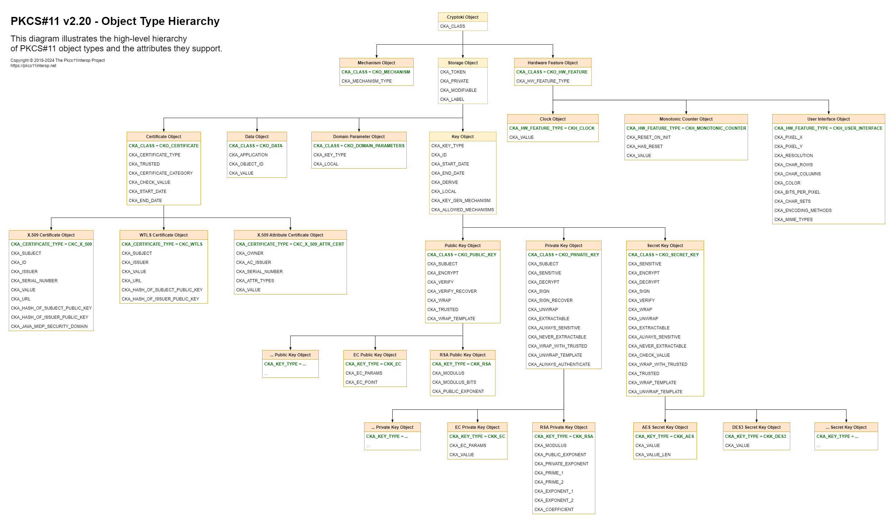

# Quick Introduction to PKCS#11 Objects

PKCS#11 object represents generic data, a certificate, a public key, a private key, or a secret key, which can be permanently stored on a token or temporarily exist in a session. Tokens can create, destroy, manipulate, and search for objects, as well as perform cryptographic functions with them without revealing their values.

## Object Handles

Every object is identified by its handle, a `ulong` identifier represented by `IObjectHandle` in Pkcs11Interop. This handle is passed to PKCS#11 functions as a parameter to specify which object the function should act on. The object handle can be used by all application threads, but it is not guaranteed to be the same between consecutive PKCS#11 library loads, so it cannot be used as a permanent identifier.

## Object Attributes

Every object consists of a set of attributes, each of which has precisely one value. 

Attribute value may hold one of the following datatypes:

- **Boolean**  
  Represented by `bool` in Pkcs11Interop.

- **Unsigned long**  
  Represented by `ulong` in Pkcs11Interop.

- **String**  
  Represented by `string` in Pkcs11Interop.

- **Array of bytes**  
  Represented by `byte[]` in Pkcs11Interop.

- **Date**  
  Represented by `DateTime` in Pkcs11Interop.

- **Array of attributes**  
  Represented by `List<ObjectAttribute>` in Pkcs11Interop.

- **Array of unsigned longs**  
  Represented by `List<ulong>` in Pkcs11Interop.

- **Array of mechanisms**  
  Represented by `List<CKM>` in Pkcs11Interop.

## Object Lifetime and Visibility

Objects are classified according to their lifetime and visibility:

- **Token objects**  
  Those with the `CKA_TOKEN` attribute set to `CK_TRUE`.  
  Token objects are visible to all applications connected to the token and remain on the token even after all sessions are closed and the token is removed from its slot.

- **Session objects**  
  Those with the `CKA_TOKEN` attribute set to `CK_FALSE`.  
  Session objects are only visible to the application that created them and are automatically destroyed when the session that created them is closed.

## Object Access Requirements

Further classification defines access requirements:

- **Public objects**  
  Those with the `CKA_PRIVATE` attribute set to `CK_FALSE`.  
  Applications are not required to log into the token to access public objects.

- **Private objects**  
  Those with the `CKA_PRIVATE` attribute set to `CK_TRUE`.  
  Applications must log into the token to access private objects.

## Object Classes

Every object has a mandatory `CKA_CLASS` attribute which determines its type/class:

- **Data objects**  
  Those with the `CKA_CLASS` attribute set to `CKO_DATA`.  
  They hold any data defined by an application e.g. plain text, XML, JSON or anything else.

- **Certificate objects**  
  Those with the `CKA_CLASS` attribute set to `CKO_CERTIFICATE`.  
  They hold public key certificates or attribute certificates e.g. X.509 certificate.

- **Public key objects**  
  Those with the `CKA_CLASS` attribute set to `CKO_PUBLIC_KEY`.  
  They hold public asymmetric keys e.g. public RSA key.

- **Private key objects**  
  Those with the `CKA_CLASS` attribute set to `CKO_PRIVATE_KEY`.  
  They hold private asymmetric keys e.g. private RSA key.

- **Secret key objects**  
  Those with the `CKA_CLASS` attribute set to `CKO_SECRET_KEY`.  
  They hold symmetric keys e.g. AES key.

There are also a few other object types (those with the `CKA_CLASS` attribute set to `CKO_*` values other than those listed above), but they are rarely used.

These basic types also have subtypes that are usable with specific mechanisms. For example, there are RSA public and RSA private keys (those with the `CKA_KEY_TYPE` attribute set to `CKK_RSA`), AES secret keys (those with the `CKA_KEY_TYPE` attribute set to `CKK_AES`), etc. Additionally, some attributes are specific to a particular type of object, such as `CKA_MODULUS` or `CKA_PUBLIC_EXPONENT`, which are valid only for RSA keys.

## Object Type Hierarchy

The following diagram illustrates the high-level hierarchy of PKCS#11 object types and the attributes they support:

*Note: Click on the picture for a larger image.*

PKCS#11 objects always contain all attributes defined by the PKCS#11 specification for a given object type. This means that, for example, any *Data object* will always hold the following attributes:

- `CKA_CLASS` with `CKO_DATA` value
- `CKA_TOKEN`
- `CKA_PRIVATE`
- `CKA_MODIFIABLE`
- `CKA_LABEL`
- `CKA_APPLICATION`
- `CKA_OBJECT_ID`
- `CKA_VALUE`

Please note that a token can hold several completely identical objects, as it is permissible for two or more objects to have exactly the same values for all their attributes.

Some attributes of an object may be modified after the object has been created, while others may not. Attributes that PKCS#11 specifies as modifiable may actually not be modifiable on some tokens.

A detailed description of each individual attribute can be found in the [PKCS#11 specification](https://github.com/Pkcs11Interop/PKCS11-SPECS).

## Attribute Templates

PKCS#11 functions that manipulate objects take a list of object attributes (often called a *template* or *attribute template*) as one of their arguments.

When a search is performed using an attribute template, the matching criterion is an exact byte-for-byte match with all attributes in the template.

Attempting to create, modify, or copy objects using an attribute template may sometimes result in one of the following errors:

- `CKR_ATTRIBUTE_TYPE_INVALID` - The template specifies a value for an invalid attribute(s).
- `CKR_ATTRIBUTE_VALUE_INVALID` - The template specifies an invalid value for a valid attribute(s).
- `CKR_ATTRIBUTE_READ_ONLY` - The template specifies a value for a read-only attribute(s).
- `CKR_TEMPLATE_INCOMPLETE` - The template does not specify some required attribute(s).
- `CKR_TEMPLATE_INCONSISTENT` - The template specifies conflicting attribute(s).

Unfortunately, the PKCS#11 API does not provide details about which attribute caused the error. However, many PKCS#11 libraries support some form of internal logging mechanism that may reveal the real cause of the error. Exact steps to enable logging should be provided in the documentation from the PKCS#11 library vendor.

[Next page >](03_SESSIONS.md)