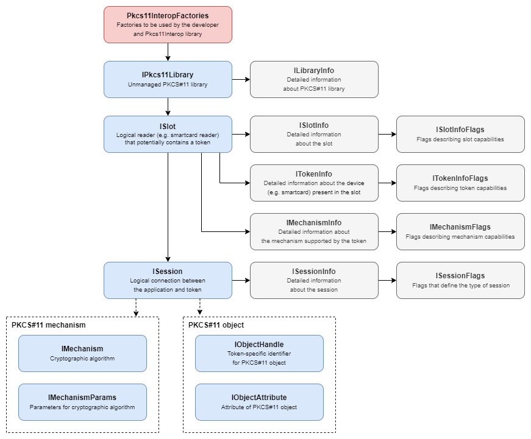

# Pkcs11Interop Interfaces

The following figure presents the relationships between classes and interfaces from the `Net.Pkcs11Interop.HighLevelAPI` namespace:

An instance of the `Pkcs11InteropFactories` class:
- Contains multiple factories used by both the developer and the Pkcs11Interop library itself.
- Is most commonly used for loading unmanaged PKCS#11 libraries and creating instances of `IPkcs11Library`.

Each instance of a class implementing the `IPkcs11Library` interface:
- Represents an unmanaged PKCS#11 library loaded during the class instance construction and unloaded when the class instance is disposed.
- Provides detailed information about the unmanaged PKCS#11 library as `ILibraryInfo`.
- Provides a list of slots visible to the unmanaged PKCS#11 library as list of `ISlot`.

Each instance of class implementing `ISlot` interface:
- Represents a logical reader (e.g. smartcard reader) in which a token (e.g. smartcard) may or may not be present. The token represents a device that stores objects (e.g. cryptographic keys) and can perform cryptographic functions.
- Provides detailed information about the slot as `ISlotInfo` with `ISlotFlags`.
- Provides detailed information about the token present in slot as `ITokenInfo` with `ITokenFlags`.
- Provides detailed information about mechanisms (algorithms) supported by the token as `IMechanismInfo` with `IMechanismFlags`.
- Opens new sessions with a token, represented by `ISession`.

Each instance of a class implementing the `ISession` interface:
- Represents a logical connection between an application and a token.
- Provides detailed information about the session as `ISessionInfo` with `ISessionFlags`.
- Creates new and manages existing objects (e.g. cryptographic keys) identified by `IObjectHandle` and manages their attributes represented by `IObjectAttribute`.
- Performs cryptographic operations identified by `IMechanism`, which may or may not require additional parameters represented by `IMechanismParams`.

Each instance of a class implementing the `IObjectHandle` interface:
- Represents generic data, a certificate, a public key, a private key, or a secret key, which can be permanently stored on a token or temporarily exist in a session.
- Can be indirectly used to read or write object attributes, each represented by `IObjectAttribute`.

Each instance of a class implementing the `IMechanism` interface:
- Represents a single cryptographic algorithm.
- May be used with or without additional parameters represented by `IMechanismParams`.

[Next page >](06_GETTING_STARTED.md)