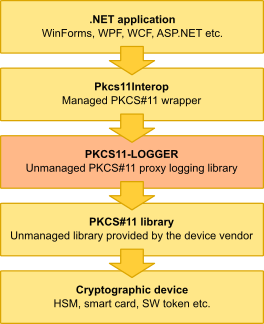

# Troubleshooting Pkcs11Interop with PKCS11-LOGGER

Pkcs11Interop loads the unmanaged PKCS#11 library provided by the cryptographic device vendor, making its functions accessible to .NET applications. The following figure presents the typical usage of the Pkcs11Interop library in a .NET application:


The next code sample demonstrates how to load the PKCS#11 library via Pkcs11Interop in a .NET application:

```csharp
string pkcs11LibraryPath = null;

if (Net.Pkcs11Interop.Common.Platform.Uses64BitRuntime)
{
    pkcs11LibraryPath = @"c:\path\to\pkcs11-x64.dll";
}
else
{
    pkcs11LibraryPath = @"c:\path\to\pkcs11-x86.dll";
}

Pkcs11InteropFactories factories = new Pkcs11InteropFactories();

using (IPkcs11Library pkcs11Library = factories.Pkcs11LibraryFactory.LoadPkcs11Library(factories, pkcs11LibraryPath, AppType.MultiThreaded))
{
    // Do something interesting
}
```

Due to the complexity of the PKCS#11 API, it is not uncommon for users to encounter communication problems between their application and the PKCS#11 library. This is where [PKCS11-LOGGER](https://github.com/Pkcs11Interop/pkcs11-logger) can be particularly useful.

The logger acts as an intermediary between the application and the original PKCS#11 library. When the application calls a PKCS#11 function via the logger, the logger invokes the same function from the original PKCS#11 library, logs all relevant information, and then returns the result to the application.

The following figure illustrates the typical usage of the Pkcs11Interop library with the PKCS11-LOGGER proxy in a .NET application:



The next code sample demonstrates how to load the PKCS#11 library using PKCS11-LOGGER and Pkcs11Interop in a .NET application:

```csharp
string pkcs11LibraryPath = null;
string loggerLibraryPath = null;
string logFilePath = null;

if (Net.Pkcs11Interop.Common.Platform.Uses64BitRuntime)
{
    pkcs11LibraryPath = @"c:\path\to\pkcs11-x64.dll";
    loggerLibraryPath = @"c:\path\to\pkcs11-logger-x64.dll";
    logFilePath = @"c:\path\to\pkcs11-logger-x64.log";
}
else
{
    pkcs11LibraryPath = @"c:\path\to\pkcs11-x86.dll";
    loggerLibraryPath = @"c:\path\to\pkcs11-logger-x86.dll";
    logFilePath = @"c:\path\to\pkcs11-logger-x86.log";
}

System.Environment.SetEnvironmentVariable("PKCS11_LOGGER_LIBRARY_PATH", pkcs11LibraryPath);
System.Environment.SetEnvironmentVariable("PKCS11_LOGGER_LOG_FILE_PATH", logFilePath);
System.Environment.SetEnvironmentVariable("PKCS11_LOGGER_FLAGS", "64");

Pkcs11InteropFactories factories = new Pkcs11InteropFactories();

using (IPkcs11Library pkcs11Library = factories.Pkcs11LibraryFactory.LoadPkcs11Library(factories, loggerLibraryPath, AppType.MultiThreaded))
{
    // Do something interesting
}
```

The analysis of the logged information should be performed by someone familiar with the [PKCS#11 specifications](https://github.com/Pkcs11Interop/PKCS11-SPECS). This person should be able to determine whether the issues stem from the managed components (i.e., the .NET application or Pkcs11Interop) or from the implementation of the unmanaged PKCS#11 library.

Here’s a brief sample of the content extracted from the beginning of the log file:

```
0x000013c8 : 0x00001078 : ****************************** 2015-12-14 23:56:07 ***
0x000013c8 : 0x00001078 : PKCS11-LOGGER 2.1.0
0x000013c8 : 0x00001078 : PKCS#11 logging proxy module
0x000013c8 : 0x00001078 : Developed as a part of the Pkcs11Interop project
0x000013c8 : 0x00001078 : Please visit www.pkcs11interop.net for more information
0x000013c8 : 0x00001078 : ****************************** 2015-12-14 23:56:07 ***
0x000013c8 : 0x00001078 : Successfuly loaded C:\SoftHSM2\lib\softhsm2-x64.dll
0x000013c8 : 0x00001078 : Memory contents are dumped without endianness conversion
0x000013c8 : 0x00001078 : ****************************** 2015-12-14 23:56:07 ***
0x000013c8 : 0x00001078 : Calling C_GetFunctionList
0x000013c8 : 0x00001078 : Input
0x000013c8 : 0x00001078 :  ppFunctionList: 000000C98228E8E0
0x000013c8 : 0x00001078 : Output
0x000013c8 : 0x00001078 :  Note: Returning function list of PKCS11-LOGGER
0x000013c8 : 0x00001078 : Returning 0 (CKR_OK)
0x000013c8 : 0x00001078 : ****************************** 2015-12-14 23:56:07 ***
0x000013c8 : 0x00001078 : Calling C_Initialize
0x000013c8 : 0x00001078 : Input
0x000013c8 : 0x00001078 :  pInitArgs: 000000C9E59AF5E0
0x000013c8 : 0x00001078 :   CreateMutex: 0000000000000000
0x000013c8 : 0x00001078 :   DestroyMutex: 0000000000000000
0x000013c8 : 0x00001078 :   LockMutex: 0000000000000000
0x000013c8 : 0x00001078 :   UnlockMutex: 0000000000000000
0x000013c8 : 0x00001078 :   Flags: 2
0x000013c8 : 0x00001078 :    CKF_LIBRARY_CANT_CREATE_OS_THREADS: FALSE
0x000013c8 : 0x00001078 :    CKF_OS_LOCKING_OK: TRUE
0x000013c8 : 0x00001078 :   pReserved: 0000000000000000
0x000013c8 : 0x00001078 : Returning 0 (CKR_OK)
0x000013c8 : 0x00001078 : ****************************** 2015-12-14 23:56:07 ***
0x000013c8 : 0x00001078 : Calling C_GetInfo
0x000013c8 : 0x00001078 : Input
0x000013c8 : 0x00001078 :  pInfo: 000000C98228E7F0
0x000013c8 : 0x00001078 : Output
0x000013c8 : 0x00001078 :  pInfo: 000000C98228E7F0
0x000013c8 : 0x00001078 :   cryptokiVersion:
0x000013c8 : 0x00001078 :    major: 2
0x000013c8 : 0x00001078 :    minor: 30
0x000013c8 : 0x00001078 :   manufacturerID: SoftHSM                         
0x000013c8 : 0x00001078 :   flags: 0
0x000013c8 : 0x00001078 :   libraryDescription: Implementation of PKCS11        
0x000013c8 : 0x00001078 :   libraryVersion:
0x000013c8 : 0x00001078 :    major: 2
0x000013c8 : 0x00001078 :    minor: 0
0x000013c8 : 0x00001078 : Returning 0 (CKR_OK)
```

**Warning: Log files produced by PKCS11-LOGGER may contain sensitive information and should not be shared publicly.**

[Next page >](09_FAQ.md)